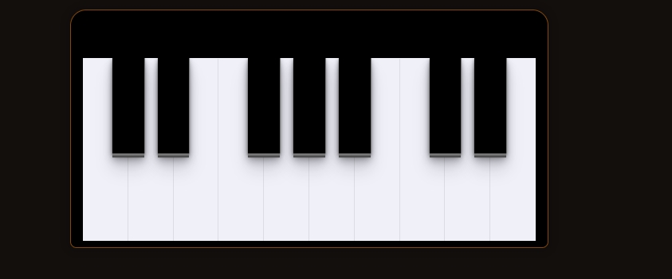

# Teclado musical utilizando HTML CSS E JAVASCRIPT

Projeto de manipulação do DOM com JavaScript.
A realização deste projeto se deu através do Masterclass Rocketseat,
tendo como referências base os seguintes projetos:

    https://codepen.io/Eliteware/pen/wDHIC
    https://codepen.io/gabrielcarol/pen/rGeEbY

    Você pode tocar o teclado com o mouse ou o próprio teclado do PC

# Musical keyboard using HTML CSS & JAVASCRIPT

Project of DOM manipulation with JavaScript.
This project were did troughth Masterclass Rocketseat,
and had your references based on links of the projects above.
You can play the keyboard with your mouse or own keyboard pc.

